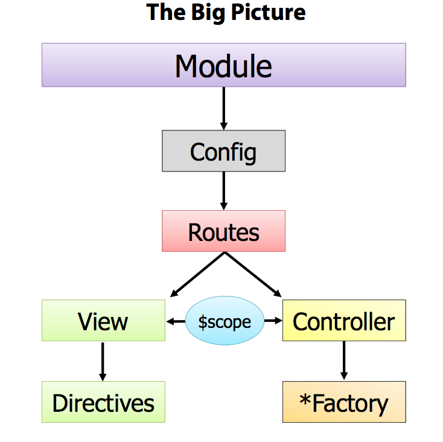
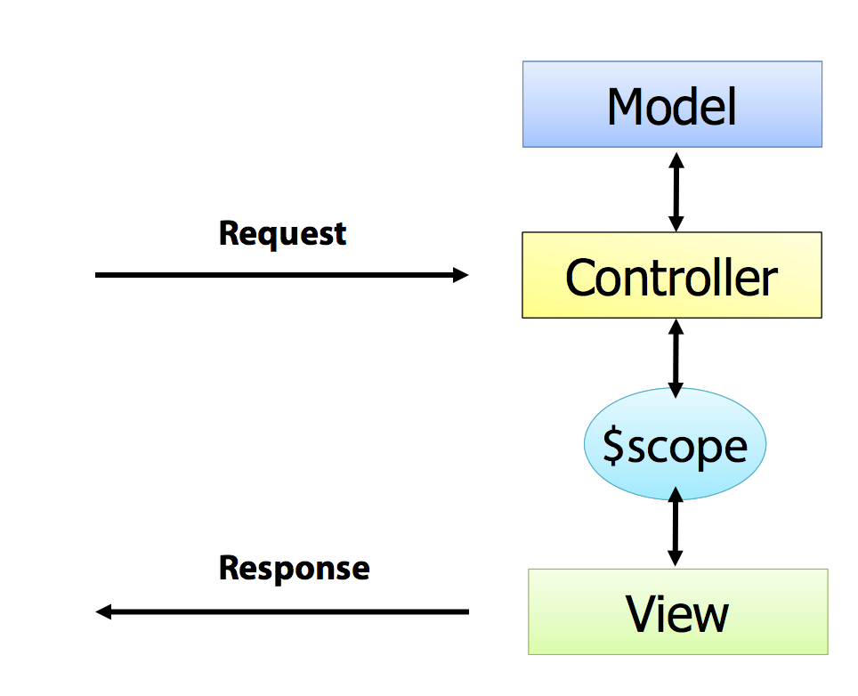

## Angular Controllers, ViewModel and Modules.

We are going to dive into Angular Controllers, ViewModels and Modules. 

## Objectives

* Use the ViewModel pattern to comunicate between a Controller and a View.
* Compare the Design Patterns and overall Architectual Pattern of Rails and Angular, MVC vs MVVM.
* Learn how the Model View ViewModel (MVVM) pattern is realized by the $scope and mapped to properties or attributes in the View.
* Use Dependency Injection to _inject_ the ViewModel, i.e. $scope.
* Implement a Controller.
* Implement an Angular Module to namespace and contain Angular components.
* Show how Module dependencies can be defined.


## Overview
_"AngularJS is JavaScript framework developed by Google. It intents to provide solid base for the development of CRUD Single-Page Applications (SPA). SPA is web application, which once loaded, does not require full page reload when the user performs any actions with it. This means that all application resources (data, templates, scripts, styles) should be loaded with the initial request or better – the information and resources should be loaded on demand. Since most of the CRUD applications has common characteristics and requirements, AngularJS intents to provide the optimal set of them out-of-the-box. ..."_ [AngularJS in Patterns](http://blog.mgechev.com/2014/05/08/angularjs-in-patterns-part-1-overview-of-angularjs/)

Few important features of AngularJS are:  

* two-way data binding _(Done)_  
* dependency injection _(In this lesson)_  
* separation of concerns _(In this lesson)_  
* testability  
* abstraction _(Some in this lesson. More later)_  



We will be looking at Controllers, $scope and Modules in this lesson. We covered Views and directive in the last lesson, [Angular Views and Directives](https://github.com/ga-wdi-boston/wdi_9_angular_demo_directives)

## Demo 

#### Setup

We have a js directory that will contain the Angular javascript, angular.js.
_At the end of the lesson we will have an app/controllers directory where the the controllers are defined._

#### ViewModel and $scope




In Angular there is an implementation of a design pattern named _ViewModel_. The ViewModel is shared between a Controller and a View. __In Angular, $scope is the ViewModel.__

* The ViewModel, ``$scope``, is injected into the Controller.
* The Controller can add or change a properties in the $scope and make them visible to the View.

Rails hides the mechanism that allows you to share properties between Controllers and Views. In Rails all one needs to do is create an instance variable in the Controller, @foo, and it becomes available to the View.

In Angular, one must _explicitly_ set a property on the ViewModel, $scope, in the Controller for it to become available in the View. 

For example, in order to share a property between a Controller and a View one __must__ set this property on the ViewModel, $scope.

In the Controller:  

```javascript
$scope.joe = {name: 'Joe', age: 38};  
$scope.dogYears = 7;
```

Is made available in the View:


```html
 <p> {{joe.name} is only {{joe.age/dogYears}} in dog years.</p>
```


#### Simple Controller

Let's refactor the code we've used in the previous lesson about Views and Directives into an Angular Controller.


__Let's start with this code in directives_last.html from the previous View/Directives lesson.__

```html
<!document html>
<html ng-app>
  <head>
    <script type='text/javascript' src='js/angular.js'></script>
  </head>
  <body ng-init="customers=[{joined: '2000-12-02', name:'John', city:'Chandler', orderTotal: 9.9956}, {joined: '1965-01-25',name:'Zed', city:'Las Vegas', orderTotal: 19.99},{joined: '1944-06-15',name:'Tina', city:'New York', orderTotal:44.99}, {joined: '1995-03-28',name:'Dave', city:'Seattle', orderTotal:101.50}]">
    <h3>Customers</h3>
    Filter: <input type="text" ng-model="customerFilter.name"/>
    <br/>
    <br/>
    <table>
      <tr>
        <th ng-click="sortBy='name';reverse=!reverse">Name</th>
        <th ng-click="sortBy='city';reverse=!reverse">City</th>
        <th ng-click="sortBy='orderTotal';reverse=!reverse">Order Total</th>
        <th ng-click="sortBy='joined';reverse=!reverse">Joined</th>
      </tr>
      <tr ng-repeat="cust in customers | filter: customerFilter | orderBy:sortBy:reverse">
        <!-- <tr ng-repeat="cust in customers"> -->
        <td>{{ cust.name }}</td>
        <td>{{ cust.city}}</td>
        <td>{{ cust.orderTotal | currency }}</td>
        <td>{{ cust.joined | date}}</td>
      </tr>
    </table>
  </body>
</html>
```

We are going to:  
1. Create a directory, app/controllers, that will contain all the Angular Controllers.  
	``mkdir -p app/controllers``  
2. Create a Controller file and add code, _see below_.  
3. Move the customers Array definition out of the the View, ng-init, and define it as a property on the $scope in the Controller. _Eventually, this data will come from the backend_.  
4. Move the sort click handlers from the view into the Controller.  


__Add this to app/controllers/customersController.js__

_Finished code is in customerControllers1_done.js_

```javascript
function CustomersController($scope){
  // 3. Define customers data in the ViewModel customers property
  $scope.customers = [{joined: '2000-12-02', name:'John', city:'Chandler', orderTotal: 9.9956}, {joined: '1965-01-25',name:'Zed', city:'Las Vegas', orderTotal: 19.99},{joined: '1944-06-15',name:'Tina', city:'New York', orderTotal:44.99}, {joined: '1995-03-28',name:'Dave', city:'Seattle', orderTotal:101.50}];

  $scope.sortBy = "name";
  $scope.reverse = false;

  // 4. Define a sort click handlers
  $scope.doSort = function(propName){
    $scope.sortBy = propName;
    $scope.reverse = !$scope.reverse;
  };
}

```

__Copy the directives_last.html to controllers.html.__  

_Finished code is in controllers1_done.html_

```html
 ...
    <!-- 2. Move code into a Controller. -->
    <script type='text/javascript' src='app/controllers/customersController.js'></script>
    
 ...
   <!-- 3. Removed customers data from ng-init into the Controller -->
  <body>
 ...
   <!-- 4. Use the sort click handler from the Controller\
 -->
        <th ng-click="doSort('name')">Name</th>
        <th ng-click="doSort('city')">City</th>
        <th ng-click="doSort('orderTotal')">Order Total</th>
        <th ng-click="doSort('joined')">Joined</th>    
```


In the above:  
* We are using the MVVM pattern by using a ViewModel, $scope.   
* We are using __dependency injection__ to inject a new instance of $scope into the new instance of a CustomersController that was created for this HTTP Request.  
* We are accessing the variables set in the $scope inside our View.  


## Lab 1

## Demo

#### Modules.

Angular Modules are used to encapsulate and namespace the components of the Angular application. 

Modules will also allow us to explictly define the app's dependencies, the libraries the app depends on.

__Remember that Javascript has no 'require', 'include' or 'import' like statements that allow us to indentify dependencies between files. This is extremely unusual in programming languages. So Angular provides this mechanism.__

##### Add a Module for your application, in app/app.js

_Finished code is in app/app_done.js_

```
(function customersAppIIFE(){
  // Create a Module for this app with a name of 'customersApp'                                                              
  // It has NO dependencies, empty Array as the second param   
  angular.module('customersApp', []);

})();
```

Notice that we are using an IIFE to create a scope that one can declare variables that will not pollute the Global namespace.

##### Modify the app/controllers/customersController.js and modify it from below.

_Finished code is in app/customerControllers2_done.js_

```
// Wrap the Controller declaration in an IFFE
// This will avoid creating another varible, CustomersController
// In the global namespace.
(function customersControllerIIFE(){

  // Controller
  var CustomersController = function($scope){

    $scope.customers = [{joined: '2000-12-02', name:'John', city:'Chandler', orderTotal: 9.9956}, {joined: '1965-01-25',name:'Zed', city:'Las Vegas', orderTotal: 19.99},{joined: '1944-06-15',name:'Tina', city:'New York', orderTotal:44.99}, {joined: '1995-03-28',name:'Dave', city:'Seattle', orderTotal:101.50}];

    $scope.sortBy = "name";
    $scope.reverse = false;

    $scope.doSort = function(propName){
      $scope.sortBy = propName;
      $scope.reverse = !$scope.reverse;
    };
  };

  // Prevent the minifier from breaking dependency injection.
  CustomersController.$inject = ['$scope'];

  // The Controller is part of the module.
  angular.module('customersApp').controller('customersController', CustomersController);

})();
```

## Documentation

[AngularJS](https://angularjs.org/)

[API Documentation](https://docs.angularjs.org/api)

This is like the $.ajax in JQuery.  
[Ajax HTTP Service](https://docs.angularjs.org/api/ng/service/$http) 